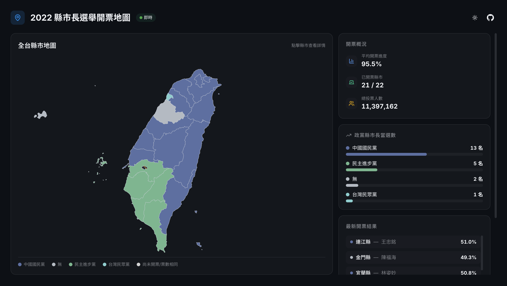
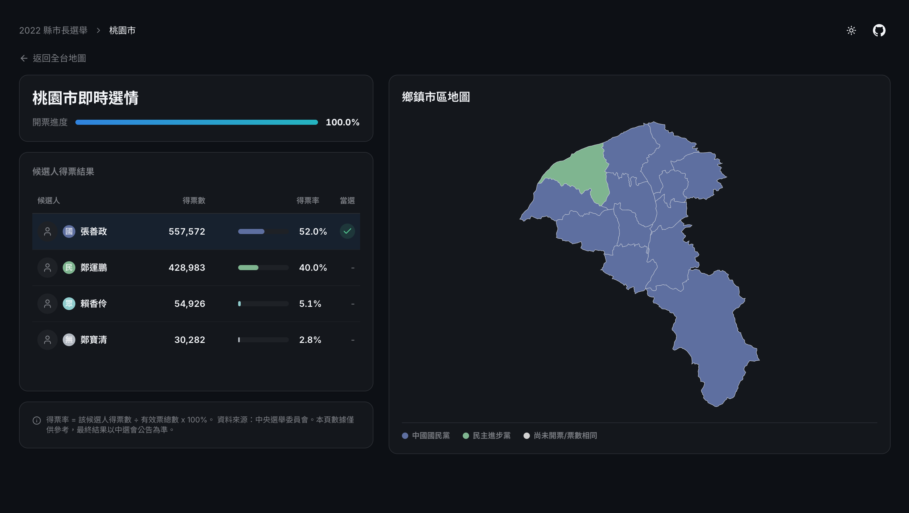

# React 開票地圖儀表板

[](https://react.dev/)
[](https://www.typescriptlang.org/)
[](https://tailwindcss.com/)
[](https://tanstack.com/query)
[](https://d3js.org/)

---

模擬大選開票情境，以互動式地圖儀表板呈現各縣市投票結果與政黨席次分佈。

_目前頁面以單次 API 查詢呈現結果，如果 API 失效則 fallback 回靜態資料，尚未實作 polling 或 WebSocket 的即時串流更新。_

### [Live Demo 點此試用](https://fionasgithub.github.io/react-tw-elections-dashboard/)

---

## 功能特色

- 全台縣市互動地圖 - 以 D3.js + TopoJSON 繪製，依政黨顏色著色
- 開票概況儀表板 - 顯示平均開票進度、已開票縣市數、總得票數（候選人得票加總）
- 政黨席次分佈 - 視覺化呈現各政黨當選席次
- 縣市詳情頁 - 點選縣市可查看所有候選人得票數與鄉鎮市區前三名
- 響應式設計 - 支援桌面與行動裝置瀏覽

## 技術架構

| 類別       | 技術                          | 說明                                  |
| ---------- | ----------------------------- | ------------------------------------- |
| 框架       | React 19 + TypeScript         | —                                     |
| 路由       | React Router v7               | 使用 HashRouter 配合 GitHub Pages     |
| 資料取得   | TanStack Query                | 自動快取、背景重新取得                |
| 狀態管理   | Zustand                       | 輕量全域狀態，管理 API 回傳之選舉資料 |
| 資料驗證   | Zod                           | 驗證 API 回應結構                     |
| 表格       | TanStack Table                | 候選人得票數據表格呈現                |
| 樣式       | Tailwind CSS v4               | Utility-first CSS                     |
| UI 元件    | shadcn/ui + Radix UI          | 可客製化的元件，高度支援 Tailwind     |
| 地圖       | D3.js + TopoJSON              | 互動式地圖                            |
| 建置       | Vite 7                        | 快速開發與打包                        |
| 部署       | GitHub Actions → GitHub Pages | 推送至 main 自動部署                  |
| 程式碼品質 | ESLint + Husky + Commitlint   | 使用 Git hooks 維護提交品質           |

## 專案啟動

### 環境需求

- Node.js 24.14.0（建議使用 nvm，專案已包含 `.nvmrc`）

### 安裝與執行

```bash
git clone https://github.com/fionasgithub/react-tw-elections-dashboard.git
cd react-tw-elections-dashboard
nvm use           # 自動切換至專案指定的 Node 版本
npm install
npm run dev       # 啟動開發伺服器
```

### 其他指令

| 指令                | 說明                |
| ------------------- | ------------------- |
| `npm run build`     | 型別檢查 + 正式建置 |
| `npm run preview`   | 預覽建置結果        |
| `npm run lint`      | ESLint 檢查         |
| `npm run typecheck` | TypeScript 型別檢查 |

## 挑戰與解決方案

1. GitHub Pages 路由 404 問題
   - 問題一（路由模式）：GitHub Pages 為靜態託管，沒有後端可做 route rewrite。使用 `BrowserRouter` 時，重新整理或直接進入子頁面可能回傳 404。
   - 問題二（連結行為）：若 `BreadcrumbLink` 使用原生 `<a>` 渲染，點擊導回首頁會生成 `href=/`；在 GitHub Pages 的子路徑部署下，`/` 不是網站首頁，因此會跑到根目錄，導致顯示 404。
   - 解決方式：將 `BrowserRouter` 改為 `HashRouter`，避免靜態網頁刷新路由 404；同時把 `BreadcrumbLink` 改為 `asChild` 搭配 `react-router-dom` 的 `Link`，確保站內導覽可正確導向。

2. 地圖資源缺漏
   - 問題：理想上應顯示至村里層級，但政府開放資料的[村里界圖](https://data.gov.tw/dataset/7438)經緯度資料有誤無法使用。
   - 解決方式：折衷改為只顯示至鄉鎮市區層級，就使用情境而言，多數使用者看到鄉鎮市區資訊已足夠。

3. 開票資料缺漏
   - 問題：2022 年因嘉義市長選舉延期，導致資料缺漏。
   - 解決方式：政府網站雖有提供補選(重選)資料，但考慮到專案定位是模擬開票情境（非即時串流），因此不補上歷史資料，改為顯示「本次未開票」作為提示。

## 專案背景

此專案為將先前與另一位前端工程師合作、於六角學院 2023 年參賽的 Vue 作品，在重新定義需求後以 React 重寫的版本。本次 [API](https://github.com/DivaDebug/api-election) 的部分則與後端工程師合作，節省不少要自己處理資料的問題。

相關連結：

- [需求書](docs/spec-2022-elections-map.md)
- [原 Vue 專案](https://github.com/chunkimi/vote-inquiry)（因串接的 Firebase 資料已停用，頁面可能無資料）

### 設計稿

首頁:



縣市詳情:



## 資料來源

中央選舉委員會

- [投開票概況資料 - 下載 2022 年直轄市長、縣市長](https://db.cec.gov.tw/ElecTable/Election?type=Mayor)

政府資料開放平台

- [直轄市、縣市界線(TWD97經緯度)](https://data.gov.tw/dataset/7442)
- [鄉鎮市區界線(TWD97經緯度)](https://data.gov.tw/dataset/7441)
