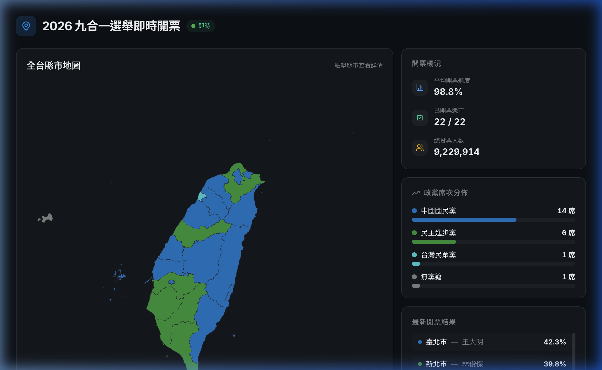

# React 即時開票地圖儀表板

模擬大選投票結束後，呈現各投開票所的即時開票狀況。

## 作品簡介

本作品透過臺灣地圖一覽各選區目前票數領先的候選人或政黨，並提供開票概況、政黨席次分布與各縣市的最新開票結果。點選地圖中的縣市後，可檢視該縣市所有候選人的得票數，以及各鄉鎮市區的前三名。

此專案為將先前與另一位前端工程師合作、於六角學院 2023 年參賽的 Vue 作品，在重新定義需求後以 React 重寫的版本。

相關連結：

- 需求書: [spec-2022-elections-map.md](docs/spec-2022-elections-map.md)
- 原 Vue 專案: [https://github.com/chunkimi/vote-inquiry](https://github.com/chunkimi/vote-inquiry)（因串接的 Firebase 資料已停用，示範頁面可能無資料）

### 設計稿

使用 Google Antigravity + UI UX Pro max skills 根據[需求書](docs/spec-2022-elections-map.md)產出的設計稿：

首頁:

縣市詳情:

## 使用技術

- React
  - react-router-dom
- Shadcn UI
  - Tailwind CSS
  - lucide-react (icons)
  - Radix UI
- D3.js
  - TopoJSON (topojson-client)

## 開發工具

- TypeScript
- Vite
- ESLint
- Husky + Commitlint
- npm

## 資料來源

中央選舉委員會

- [投開票概況資料 - 下載 2022 年直轄市長、縣市長](https://db.cec.gov.tw/ElecTable/Election?type=Mayor)

政府資料開放平台

- [直轄市、縣市界線(TWD97經緯度)](https://data.gov.tw/dataset/7442)
- [鄉鎮市區界線(TWD97經緯度)](https://data.gov.tw/dataset/7441)

## 困難點分享

- 地圖資料來源缺漏：理想上應該可以顯示到村里的資訊，但因為[村里界圖](https://data.gov.tw/dataset/7438)的經緯度圖資來源有問題無法下載，故折衷只顯示到鄉鎮市區。
- 設計稿產出：本來打算利用 [pencil.dev](https://www.pencil.dev/) 快速產出設計稿，但在嘗試使用 vscode 整合時，一直無法產出理想的設計稿，後來改用 antigravity + ui ux pro max skills 就完成了。
